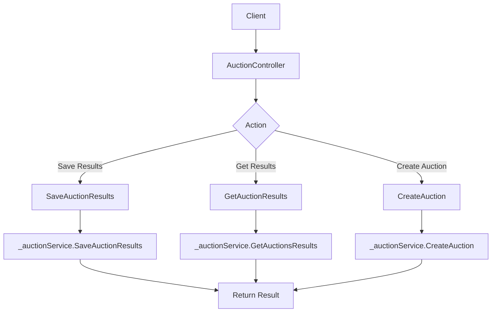

# Auction Controller Documentation

## Overview

The `AuctionController` is an API controller that manages auction-related operations in an ASP.NET Core application. It provides endpoints for saving auction results, retrieving auction results, and creating new auctions.

## Class: AuctionController

### Purpose
Handles HTTP requests related to auction operations.

### Attributes
- `_auctionService`: An instance of `IAuctionService` used to perform auction-related operations.

### Constructor
```csharp
public AuctionController(IAuctionService auctionService)
```
Initializes a new instance of the `AuctionController` class with the provided `IAuctionService`.

### Methods

#### SaveAuctionResults
```csharp
[HttpPost(\"saveResults\")]
public async Task<IActionResult> SaveAuctionResults([FromQuery] string orgId, [FromQuery] int lotId)
```

**Purpose:** Saves auction results for a specific organization and lot.

**Input Parameters:**
- `orgId` (string): The organization ID.
- `lotId` (int): The lot ID.

**Return Value:** 
- `IActionResult`: Returns an `Ok` result with the saved auction results or a `BadRequest` if the organization ID is missing.

**Notes:**
- Validates the `orgId` parameter.
- Handles exceptions and logs errors.

#### GetAuctionResults
```csharp
[HttpGet(\"results\")]
public async Task<IActionResult> GetAuctionResults([FromQuery] string orgId, [FromQuery] int lotId)
```

**Purpose:** Retrieves auction results for a specific organization and lot.

**Input Parameters:**
- `orgId` (string): The organization ID.
- `lotId` (int): The lot ID.

**Return Value:**
- `IActionResult`: Returns an `Ok` result with the retrieved auction results or a `BadRequest` if the organization ID is missing.

**Notes:**
- Validates the `orgId` parameter.
- Handles exceptions and logs errors.

#### CreateAuction
```csharp
[HttpPost(\"create/auction/{eventId}\")]
public async Task<IActionResult> CreateAuction(int eventId)
```

**Purpose:** Creates a new auction for a specific event.

**Input Parameters:**
- `eventId` (int): The ID of the event for which to create an auction.

**Return Value:**
- `IActionResult`: Returns an `Ok` result with the creation status or a `BadRequest` if the creation fails.

## Usage Examples

### Saving Auction Results
```http
POST /api/v1/Auction/saveResults?orgId=ORG123&lotId=456
```

### Retrieving Auction Results
```http
GET /api/v1/Auction/results?orgId=ORG123&lotId=456
```

### Creating a New Auction
```http
POST /api/v1/Auction/create/auction/789
```

## Dependencies and Setup

1. This controller depends on the `IAuctionService` interface, which should be implemented and registered in the dependency injection container.
2. Serilog is used for logging and should be properly configured in the application.
3. The controller inherits from `CommonBaseController`, which may contain additional shared functionality.

## Flowchart



## Notes

1. Error handling is implemented for each method, but it could be further improved by adding more specific error messages or custom exception handling.
2. The controller uses query parameters for `orgId` and `lotId` in the `SaveAuctionResults` and `GetAuctionResults` methods. Consider using route parameters for a more RESTful approach.
3. The `CreateAuction` method could benefit from additional input validation for the `eventId` parameter.
4. Consider implementing authentication and authorization to secure the API endpoints.
5. The controller could be extended to include additional auction-related operations such as updating or deleting auctions.

